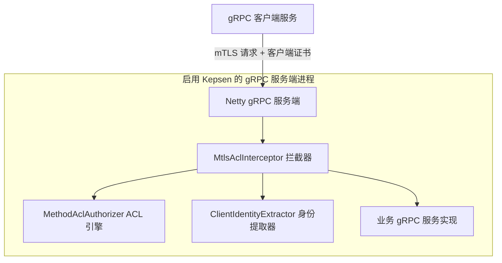
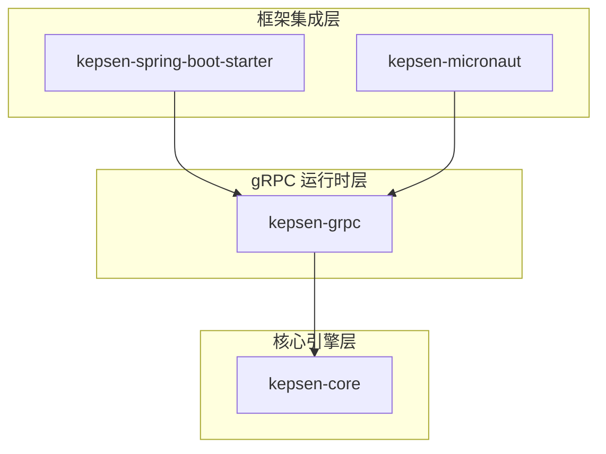
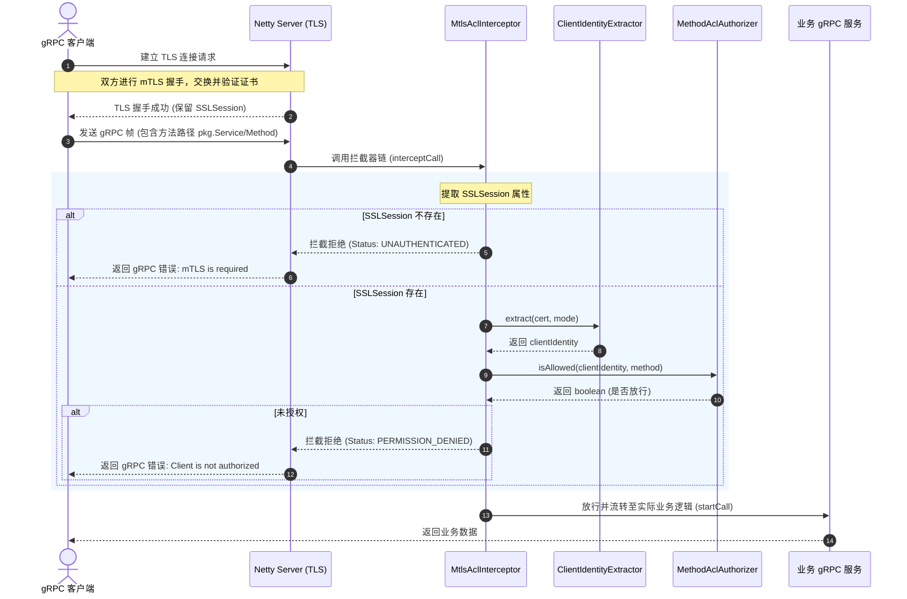

# Kepsen 架构设计与系统概览

本文档为后端开发人员与系统架构师提供 Kepsen 的高水平系统架构概览与设计深度解析。Kepsen 是一个多模块 Java 安全库，旨在为 gRPC 服务端提供轻量级的双向 TLS 认证（mTLS）与方法级访问控制列表（ACL）授权。

---

## 1. 系统上下文与定位 (System Context)

在微服务架构中，保障服务间通信（East-West Traffic）的安全至关重要。常见的做法是采用服务网格（Service Mesh，如 Istio 或 Linkerd）提供基础设施级别的 mTLS 与授权。然而，服务网格引入了额外的 Sidecar 代理（如 Envoy）、控制面组件以及运维复杂度。

Kepsen 提供了一种**进程内（In-Process）**的轻量级替代方案。它不依赖外部代理，直接嵌入在 Java gRPC 服务进程中，拦截请求并执行安全校验。



### 适用场景与限制
* **适用场景**：Java 架构体系、希望在无服务网格的环境下实现服务间加密通信（mTLS）和方法级白名单授权、使用 SPIFFE/SPIRE 或自定义证书签发机构发行身份证书。
* **限制**：如果服务前置了终止 TLS 的代理（如网关、外部负载均衡器），则不应使用 Kepsen。因为 TLS 终止后，gRPC 的 `SSLSession` 将不再包含原始客户端证书，导致 Kepsen 无法提取身份。

---

## 2. 容器与模块架构 (Container & Modules)

Kepsen 采用高内聚、低耦合的多模块设计。核心引擎被设计为无外部框架依赖的纯 Java 模块，再通过薄适配层接入主流的应用框架。



### 模块职责与依赖关系

| 模块名称 | 核心类型与位置 | 职责描述 | 外部依赖 |
|---|---|---|---|
| **kepsen-core** | [ClientIdentityExtractor.java](file:///f:/kepsen/kepsen-core/src/main/java/uk/sienne/grpcauth/core/ClientIdentityExtractor.java)<br>[MethodAclAuthorizer.java](file:///f:/kepsen/kepsen-core/src/main/java/uk/sienne/grpcauth/core/MethodAclAuthorizer.java) | 包含纯 Java 实现的 ACL 配置模型、规则评估引擎、X509 证书身份提取逻辑。不依赖任何第三方运行时框架。 | 仅 JDK 21 标准库 |
| **kepsen-grpc** | [MtlsAclInterceptor.java](file:///f:/kepsen/kepsen-grpc/src/main/java/uk/sienne/grpcauth/grpc/MtlsAclInterceptor.java)<br>[NettyMtlsServerConfigurer.java](file:///f:/kepsen/kepsen-grpc/src/main/java/uk/sienne/grpcauth/grpc/NettyMtlsServerConfigurer.java) | gRPC 专用拦截器与 Netty mTLS 通道配置器，将核心引擎适配到 gRPC-Java 运行时。 | `grpc-netty`, `netty-handler` |
| **kepsen-spring-boot-starter** | [GrpcMtlsAutoConfiguration.java](file:///f:/kepsen/kepsen-spring-boot-starter/src/main/java/uk/sienne/grpcauth/spring/GrpcMtlsAutoConfiguration.java) | Spring Boot 自动装配层，负责声明各种配置属性绑定并将拦截器自动注册为全局拦截器。 | `spring-boot-autoconfigure`, `grpc-server-spring-boot-starter` |
| **kepsen-micronaut** | [MicronautMtlsServerCustomizer.java](file:///f:/kepsen/kepsen-micronaut/src/main/java/uk/sienne/grpcauth/micronaut/MicronautMtlsServerCustomizer.java) | Micronaut 适配层，通过监听 Bean 创建事件来定制 Netty 传输通道，实现属性声明式绑定与依赖注入。 | `micronaut-inject`, `micronaut-grpc-runtime` |

---

## 3. 核心组件详解 (Component Deep Dive)

### 3.1 客户端身份提取引擎 (Client Identity Extractor)
[ClientIdentityExtractor.java](file:///f:/kepsen/kepsen-core/src/main/java/uk/sienne/grpcauth/core/ClientIdentityExtractor.java) 负责从客户端 X509 证书中提取安全唯一的身份标识。支持三种提取模式：
1. **`san-uri`**：提取证书的主题备用名称（Subject Alternative Name）中的第一个 URI 属性。这种模式与 SPIFFE 规范兼容（例如：`spiffe://example.com/ns/default/sa/payment-svc`）。
2. **`cn`**：提取证书主题可判别名称（Subject DN）中的 Common Name（CN）。
3. **`san-uri-then-cn`**：混合模式，优先使用 SAN URI，如果不存在则回退至 CN。如果两者均无，抛出异常。

### 3.2 规则评估引擎 (Method ACL Authorizer)
[MethodAclAuthorizer.java](file:///f:/kepsen/kepsen-core/src/main/java/uk/sienne/grpcauth/core/MethodAclAuthorizer.java) 负责管理和索引 ACL 访问控制规则。

为了保障 gRPC 请求路径上的绝对高性能，规则在构造阶段就被编译、去重并建立了三级高速索引，从而将运行时的权限检索时间复杂度控制在 O(1)。
* **第一级：精确匹配索引 (Exact Match Index)**
  使用哈希表 `exactMethodClients` 存储，Key 为完整方法名（格式如 `pkg.Service/Method`），Value 为允许访问的客户端身份 Set。
* **第二级：服务级通配符索引 (Service Wildcard Index)**
  使用哈希表 `serviceClients` 存储，Key 为服务名（格式如 `pkg.Service`），Value 为允许访问的客户端身份 Set。用于处理诸如 `pkg.Service/*` 的通配符规则。
* **第三级：全局通配符列表 (Global Wildcard Index)**
  使用集合 `globalClients` 存储，仅匹配声明为 `*` 的全局放行规则。

#### ACL 评估逻辑流程：
```
收到请求 (Method: fullMethodName, Client: clientIdentity)
   |
   +--> 1. 检查精确索引 `exactMethodClients`
   |       匹配成功 -> 客户端在 Set 中？是 -> 放行 (Allow) / 否 -> 拒绝 (Deny)
   |
   +--> 2. 检查服务级通配符索引 `serviceClients`
   |       匹配成功 -> 客户端在 Set 中？是 -> 放行 (Allow) / 否 -> 拒绝 (Deny)
   |
   +--> 3. 检查全局通配符集合 `globalClients`
   |       匹配成功 -> 客户端在 Set 中？是 -> 放行 (Allow) / 否 -> 拒绝 (Deny)
   |
   +--> 4. 若以上规则均未被匹配 (未配置针对该方法的规则)
           -> 返回默认动作配置 (Default Action: allow 或 deny)
```

---

## 4. 运行时生命周期与请求时序 (Execution Flow)

当客户端发起 gRPC 请求时，会经历 Netty 传输层握手、gRPC 拦截器链路过滤，最终才到达业务层。



---

## 5. 配置模型 (Configuration Reference)

Kepsen 抽象出一套标准的声明式配置结构。无论是 Spring Boot 的 `application.yml` 还是 Micronaut 的属性配置，都完全映射到这两个底层模型上：

### 5.1 mTLS 配置模型 (`mtls.server`)
对应核心类 [MtlsConfig.java](file:///f:/kepsen/kepsen-core/src/main/java/uk/sienne/grpcauth/core/MtlsConfig.java)：
* **`enabled`** (boolean): 是否启用 mTLS。若设为 false，则不强制检查客户端证书。
* **`cert-chain`** (String): 服务端证书链文件路径（支持 classpath 路径、本地文件路径或前缀为 `file:` 的 URI）。
* **`private-key`** (String): 服务端私钥文件路径。
* **`trust-cert-collection`** (String): 用于验证客户端证书的 CA 根证书集合文件路径。

### 5.2 访问控制配置模型 (`service-acl`)
对应核心类 [AclConfig.java](file:///f:/kepsen/kepsen-core/src/main/java/uk/sienne/grpcauth/core/AclConfig.java)：
* **`enabled`** (boolean): 是否启用 ACL 校验。若设为 false，即使拦截器处于链条中也会直接放行。
* **`default-action`** (String): 默认动作，可选值为 `allow` 或 `deny`。当方法没有任何匹配的 ACL 规则时应用此默认值。
* **`identity-source`** (String): 客户端标识提取源，可选值为 `san-uri`、`cn` 或 `san-uri-then-cn`。
* **`rules`** (Map<String, AclRule>): 命名的规则映射表。Key 为规则助记名称，Value 包含：
  * `method`：匹配方法模式（例如 `pkg.Service/Method`、`pkg.Service/*` 或 `*`）。
  * `allowed-clients`：允许的客户端标识字符串列表。

---

## 6. 架构决策与权衡 (Architectural Tradeoffs)

作为系统架构师，在引入 Kepsen 时需要关注以下关键设计决策的权衡：

### 6.1 进程内校验 vs 外部 Sidecar 代理
* **选择进程内校验（Kepsen）的优势**：
  * **极低延迟**：省去了 Sidecar Proxy（如 Envoy）的环回网络跳转（Loopback Network Hop），无额外的序列化/反序列化延迟。
  * **超低资源开销**：不需要为每个业务容器额外运行一个 Proxy 进程，大幅节省内存和 CPU。
  * **简易部署**：作为一个简单的 Jar 依赖随应用一起打包发布，完全兼容现有 CI/CD。
* **劣势**：
  * **语言限制**：Kepsen 仅支持 JVM 生态（Java, Kotlin, Scala等）。而网关或 Sidecar 可独立于语言工作。
  * **升级耦合**：Kepsen 的升级需要业务重新编译构建并重新部署。

### 6.2 强静态索引 vs 动态匹配
* **设计抉择**：Kepsen 在类初始化阶段就将所有配置展开，在内部构建出确定性的 Map 和 Set 索引（O(1) 复杂度）。
* **结果**：对于高频 gRPC 服务，这最大程度地优化了吞吐量；但也意味着如果需要动态调整 ACL 规则或新增授权客户端，必须通过配置发布并配合服务滚动重启或 Pod 轮转生效。

### 6.3 证书的管理职责边界
* **设计抉择**：Kepsen 被有意设计为**不管理证书生命周期**。它不负责证书的签发、下发、在线轮换或 ACME 交互。
* **结果**：这使得底层引擎极其纯粹，无其他系统耦合。用户可以通过外部基础设施（如 Kubernetes Secrets、SPIRE Workload API、基于 Vault/Consul 的外部定时 Cron 轮换脚本）将证书写到指定磁盘文件上，Kepsen 只在服务启动和上下文建立时读取这些位置。
