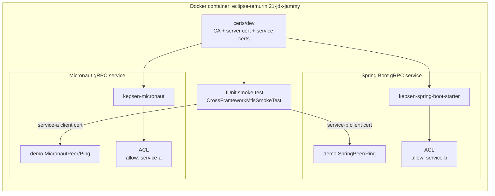
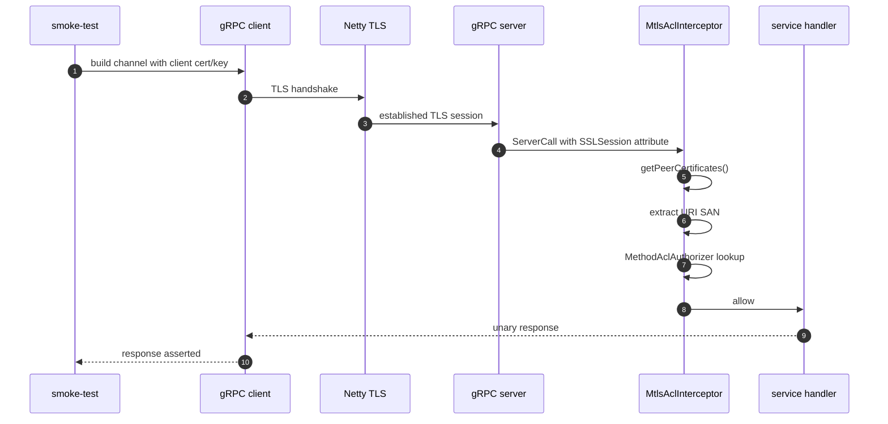
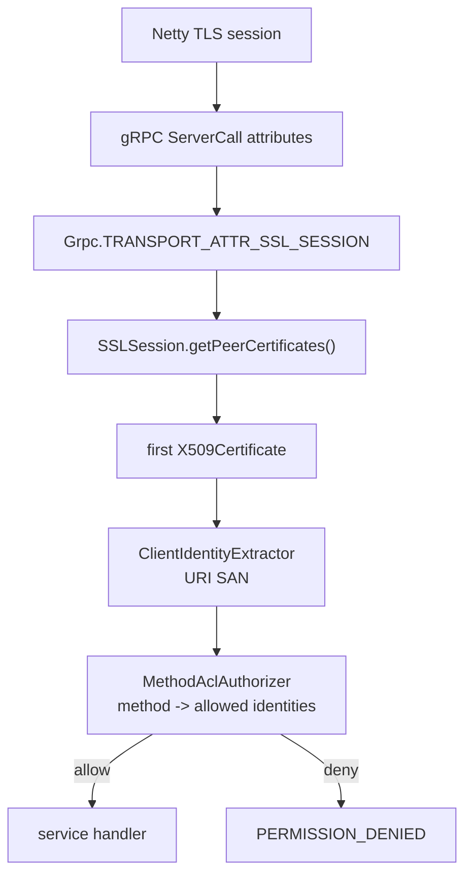

# Spring Boot / Micronaut mTLS Smoke 验证报告

## 结论

本次验证在 Docker 内完成，使用 Temurin 21 编译并实际启动两个 gRPC 服务：

- Spring Boot 服务真实引入 `kepsen-spring-boot-starter`
- Micronaut 服务真实引入 `kepsen-micronaut`
- 双向调用都使用 `certs/dev` 下的客户端证书发起 TLS 握手
- 服务端从 gRPC `SSLSession` 读取 peer X509 certificate，再按 URI SAN 做 ACL 判断

最终验证命令：

```powershell
docker-compose --profile smoke run --rm mtls-smoke
```

最终结果：

```text
BUILD SUCCESSFUL in 15s
24 actionable tasks: 21 executed, 3 up-to-date
```

## 验证拓扑



## mTLS 调用链



## 验证矩阵

| Case | Client certificate | Target method | Expected | Runtime evidence |
|---|---|---|---|---|
| Spring -> Micronaut | `service-a.crt` | `demo.MicronautPeer/Ping` | allow | `response=micronaut:from-spring` |
| Micronaut -> Spring | `service-b.crt` | `demo.SpringPeer/Ping` | allow | `response=spring:from-micronaut` |
| Wrong client -> Spring | `service-a.crt` | `demo.SpringPeer/Ping` | deny | `status=PERMISSION_DENIED` |
| No client cert -> Spring | none | `demo.SpringPeer/Ping` | reject before handler | `status=UNAVAILABLE` |

## 证书身份

开发证书的关键字段：

```text
server.crt
  Subject: CN=grpc-server
  SAN:
    DNS: localhost
    IP: 127.0.0.1
  EKU:
    serverAuth

service-a.crt
  Subject: CN=service-a
  SAN:
    URI: spiffe://internal/ns/default/sa/service-a
  EKU:
    clientAuth

service-b.crt
  Subject: CN=service-b
  SAN:
    URI: spiffe://internal/ns/default/sa/service-b
  EKU:
    clientAuth
```

ACL 配置使用 `identity-source=san-uri`。因此测试验证的是证书 URI SAN，不是 CN，也不是 gRPC metadata。

## 日志证据

以下日志来自实际执行：

```powershell
docker-compose --profile smoke run --rm mtls-smoke
```

完整关键片段：

```text
> Task :smoke-test:test

CrossFrameworkMtlsSmokeTest > springAndMicronautServicesExchangeTrafficOverMtls() STANDARD_OUT
    MTLS_SMOKE ports spring=46047 micronaut=34261 certDir=/workspace/certs/dev
    MTLS_SMOKE allow client=spiffe://internal/ns/default/sa/service-a target=demo.MicronautPeer/Ping response=micronaut:from-spring
    MTLS_SMOKE allow client=spiffe://internal/ns/default/sa/service-b target=demo.SpringPeer/Ping response=spring:from-micronaut
    2026-05-25T00:58:23.616Z  WARN 272 --- [ault-executor-0] u.s.grpcauth.grpc.MtlsAclInterceptor     : decision=deny reason=acl_miss method=demo.SpringPeer/Ping client_hash=a291adda3faef905b06cc5af
    MTLS_SMOKE deny client=spiffe://internal/ns/default/sa/service-a target=demo.SpringPeer/Ping status=PERMISSION_DENIED
    MTLS_SMOKE reject client=no-client-cert target=demo.SpringPeer/Ping status=UNAVAILABLE

BUILD SUCCESSFUL in 15s
24 actionable tasks: 21 executed, 3 up-to-date
```

证据含义：

- `allow client=...service-a target=demo.MicronautPeer/Ping`：Spring 侧用 `service-a` 证书调用 Micronaut，TLS 和 ACL 均通过。
- `allow client=...service-b target=demo.SpringPeer/Ping`：Micronaut 侧用 `service-b` 证书调用 Spring，TLS 和 ACL 均通过。
- `decision=deny reason=acl_miss method=demo.SpringPeer/Ping`：Kepsen interceptor 已进入服务端请求路径，证书身份解析后未命中 ACL。
- `status=PERMISSION_DENIED`：同 CA 签发的错误客户端证书可以完成 TLS，但被方法级 ACL 拒绝。
- `status=UNAVAILABLE`：没有客户端证书时 TLS client auth 失败，请求无法正常进入业务 handler。

## 热路径确认



本次验证确认 Hot Path 里参与鉴权的是 TLS peer certificate：

- 没有读取请求 header
- 没有使用 gRPC metadata 注入身份
- 没有模拟调用授权器
- 没有绕过 Spring Boot / Micronaut adapter

## 工程入口

验证工程：

```text
examples/mtls-smoke
  common-rpc
  spring-boot-service
  micronaut-service
  smoke-test
```

Docker 入口：

```text
Dockerfile
  target: mtls-smoke

docker-compose.yml
  service: mtls-smoke
  profile: smoke
```

Compose 命令实际执行：

```text
./gradlew --no-daemon -p examples/mtls-smoke cleanTest test --rerun-tasks
```

`--rerun-tasks` 用来避免 Gradle test cache 直接复用旧结果。
